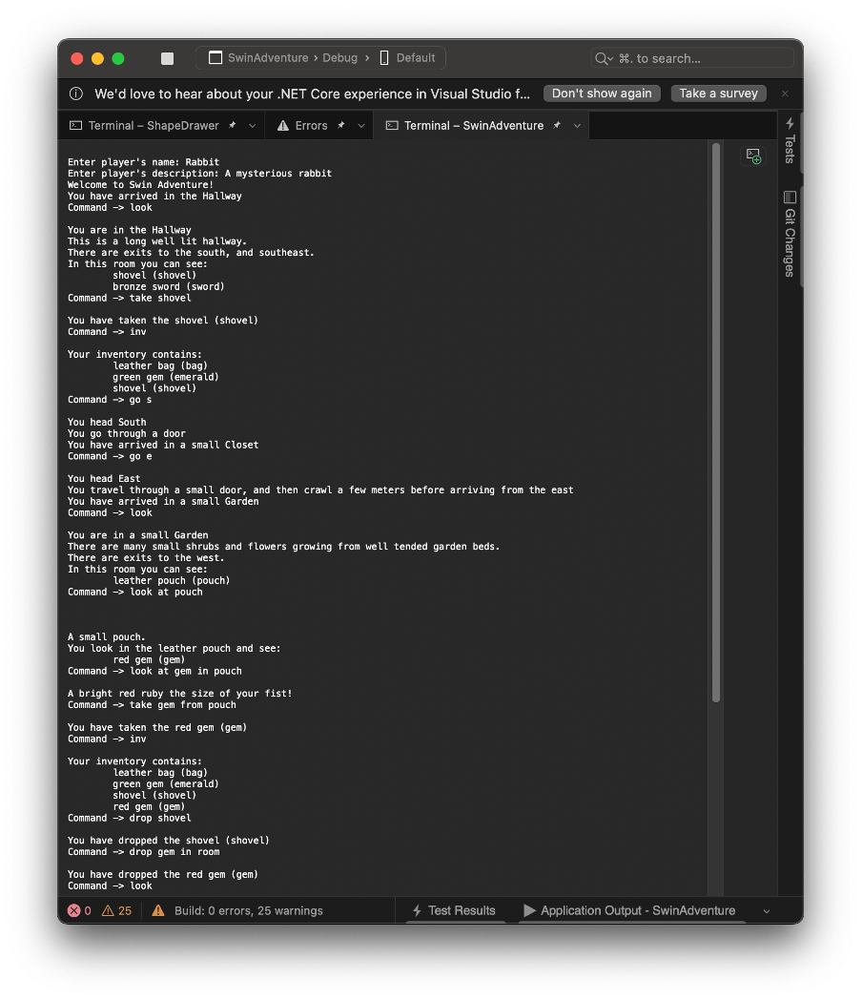
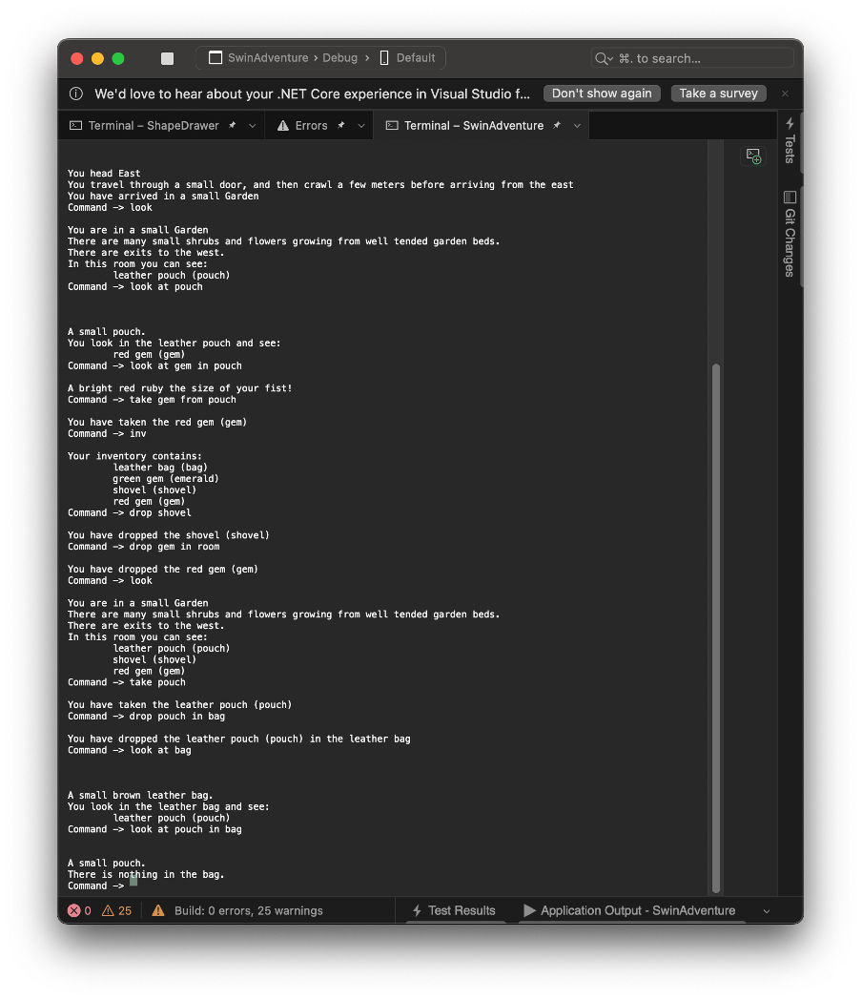

# SwinAdventure

SwinAdventure is a simple text-based adventure game where players explore a world through typed commands.

## Features

### Navigation System
Move between locations using direction-based commands: N, S, E, W, NE, NW, SE, SW.

### Inventory Management
Use Take and Drop commands to manage items. Players are able to carry regular items and containers like bags, which can hold other items.

### Nested Inventories
Bags can function as both items and inventories, allowing for layered storage. For example, a gem inside a bag, where the bag is an item in the player's' inventory.

### Command System
A built-in command processor handles player input, interpreting actions such as:
- Move: change location (Commands: move, go, head, leave)
- Look: examine rooms, items, or containers (Commands: Look, examine, look at, look in)
- Inventory: list current items (Commands: Inv, Inventory)
- Take: pick up an item (Commands: Pickup, take)
- Drop: drop an item (Commands: Drop, put)
    
### Interactive Environment
- Locked and open paths connect locations.
- Players can unlock paths to access new areas.
    
### Identifiable Objects
Items are designed with identifiers so they can be referenced in commands (examples: look at gem, take potion).

## Unit Tests
The unit tests verify the functionality of key game components such as command processing, inventory behavior, object identification, and player movement. Tests cover both simple and nested interactions, such as taking and removing items from containers/inventory and moving through open and locked paths.
    

